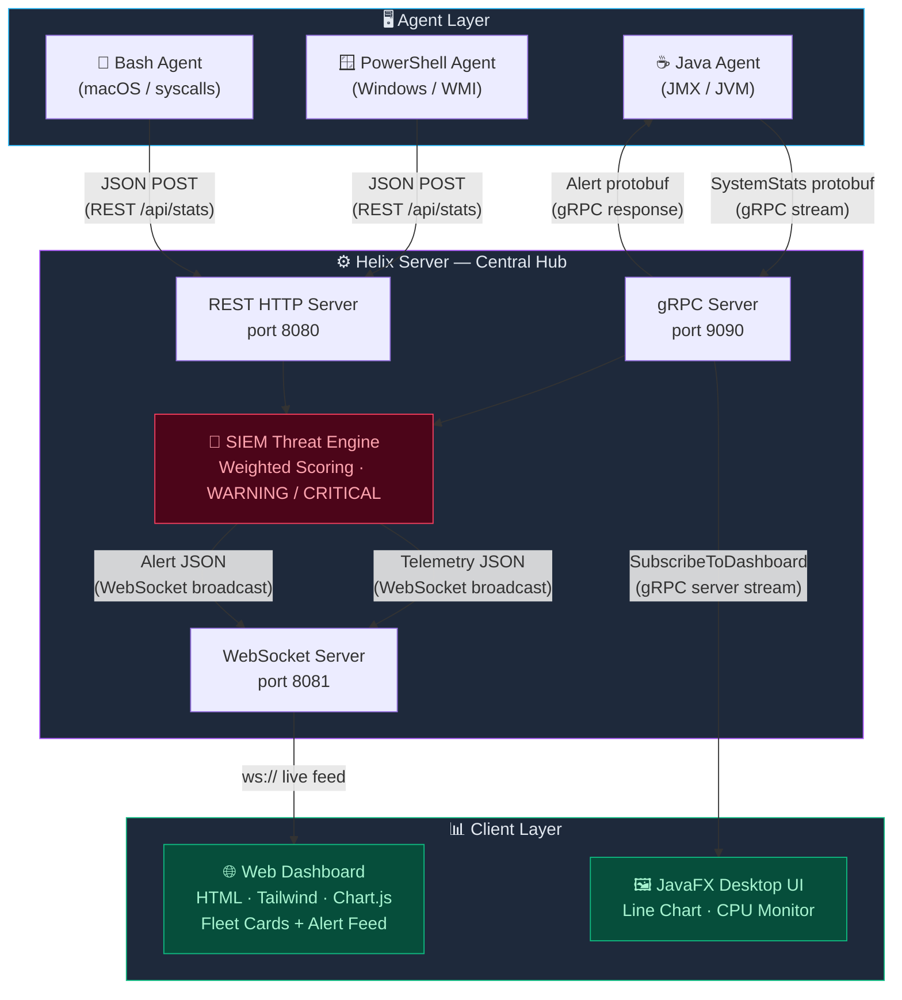

# 🌀 Helix — Live Fleet Intelligence

<div align="center">

  [](https://openjdk.org)
  [](https://grpc.io)
  [](https://developer.mozilla.org/en-US/docs/Web/API/WebSockets_API)
  [](https://tailwindcss.com)
  [](https://chartjs.org)
  [](https://azure.microsoft.com)
  [](https://maven.apache.org)
  [](https://protobuf.dev)

  **A real-time distributed system telemetry monitoring and intelligent threat-detection platform for SRE operations.**

  *Monitor entire fleets of heterogeneous nodes — Windows, macOS, and Linux — from a single live command dashboard.*

</div>


## 🌟 Features

<div align="center">

  | 🖥️ **Multi-Node Fleet View** | 📡 **Dual-Protocol Ingestion** | 🔐 **SIEM Threat Engine** |
  |:----------------------------:|:------------------------------:|:-------------------------:|
  | Live per-node telemetry cards | gRPC bidirectional streaming | Weighted heuristic scoring |
  | Sparkline CPU & RAM charts | REST/WebSocket for shell agents | WARNING / CRITICAL alerts |

  | ⚡ **Sub-Second Latency** | 🌐 **Cross-Platform Agents** | 🔄 **Auto-Reconnect** |
  |:-------------------------:|:----------------------------:|:---------------------:|
  | Real-time dashboard render | Java, PowerShell, Bash | 5-second heartbeat pacing |
  | 45-point rolling chart buffer | Zero-dependency shell agents | High-availability design |

</div>


## ✨ What Makes Helix Special?

- **📊 Live Fleet Dashboard** — Dynamically spawned per-node cards with sparkline CPU/RAM charts, disk progress bars, thread counts, and network Rx/Tx — all updating every second
- **⚡ Dual-Protocol Server** — A single Java server simultaneously runs gRPC (port 9090), REST HTTP (port 8080), and WebSocket broadcast (port 8081) to accommodate every agent type
- **🔐 SIEM Threat Scoring** — A weighted rule engine evaluates every incoming telemetry packet across CPU, RAM, disk, network, and thread heuristics, generating severity-classified alerts in under 2 seconds
- **🌍 Cross-Platform Agents** — One Java agent for JVM hosts, a PowerShell agent for Windows via WMI, and a Bash agent for macOS via native syscalls — all transmitting the same data structure
- **🔄 High-Availability Reconnect** — Agents automatically re-dial the server with 5-second backoff on any stream failure, making the fleet self-healing
- **🛡️ Backward Compatibility** — Server-side payload normalization gracefully patches missing fields from older agent versions, preventing runtime crashes
- **📍 Azure-Deployed** — Production server running on Azure Central India, accessible from any device with a browser
- **🎨 Zero-Dependency Frontend** — Pure HTML5 + Tailwind CSS + Chart.js dashboard, served as a single file with no build step required


## 🚀 Quick Start

### Prerequisites

```bash
# Java 8 or higher
java -version

# Apache Maven 3.x
mvn -version

# (For shell agents) PowerShell 5.1+ on Windows or Bash on macOS/Linux
```

### Build the Server & Agents

1. **Clone the repository**
   ```bash
   git clone https://github.com/yourusername/helix-fleet-intelligence.git
   cd helix-fleet-intelligence
   ```

2. **Compile and package the fat JAR**
   ```bash
   mvn clean package
   ```
   Maven will automatically generate gRPC stubs from `monitor.proto` via `protobuf-maven-plugin`.

3. **Start the Helix Server**
   ```bash
   java -jar target/live-system-sentinel-1.0-SNAPSHOT.jar
   ```
   You should see:
   ```
   Starting WebSocket Server on port 8081...
   WebSocket Server started successfully on port 8081!
   Starting REST HTTP Server on port 8080...
   Starting gRPC SentinelServer on port 9090...
   gRPC SentinelServer is up and listening for telemetry!
   ```

4. **Connect a Java Agent**
   ```bash
   java -cp target/live-system-sentinel-1.0-SNAPSHOT.jar \
     com.sentinel.agent.SystemMonitorAgent <SERVER_IP> <AGENT_NAME>
   ```

5. **Connect a Windows Agent**
   ```powershell
   # Run in PowerShell as Administrator
   .\windows-agent.ps1
   ```

6. **Connect a macOS Agent**
   ```bash
   chmod +x mac-agent.sh
   ./mac-agent.sh
   ```

7. **Open the Web Dashboard**

   Open `index.html` in any modern browser. The dashboard will connect to the WebSocket server and begin rendering live node cards automatically.


## 🏗️ System Architecture




## 🛠️ Tech Stack

<div align="center">

  
  
  
  
  

</div>

| Category | Technology |
|---|---|
| **Languages** | Java 8+, JavaScript (ES6), PowerShell 5.1+, Bash |
| **Communication** | gRPC (`grpc-netty-shaded` 1.61.0), WebSocket (`Java-WebSocket` 1.5.6), REST (Java built-in `HttpServer`) |
| **Serialization** | Protocol Buffers 3.25.3, Gson 2.10.1 |
| **Frontend** | Tailwind CSS (CDN), Chart.js 4.4.1, Vanilla HTML5 |
| **Desktop UI** | JavaFX 21.0.2 (OpenJFX) |
| **Build** | Apache Maven 3.x, `maven-shade-plugin`, `protobuf-maven-plugin` |
| **Cloud** | Microsoft Azure VM (Standard, Central India region) |
| **Security** | Custom SIEM weighted heuristic threat-scoring engine |
| **OS Support** | Windows 10/11, macOS (Intel & Apple Silicon), Ubuntu Linux |


## 💡 How It Works

### 1. 📡 Telemetry Collection

Each agent samples the host machine every second and emits a 10-field telemetry payload:

| Field | Description |
|---|---|
| `agent_id` | Unique hostname of the reporting node |
| `cpu` | CPU utilization percentage |
| `ram` | Used RAM in MB |
| `threads` | Active thread count |
| `disk_percent` | C: / root drive usage percentage |
| `network_rx_mb` | Cumulative bytes received (MB) |
| `network_tx_mb` | Cumulative bytes transmitted (MB) |
| `uptime_hours` | Time since last system boot (hours) |

Java agents use JMX (`OperatingSystemMXBean`, `ThreadMXBean`) and serialize via Protobuf over gRPC. Shell agents use native OS APIs (WMI on Windows, `top`/`netstat` on macOS) and POST raw JSON to the REST endpoint.

### 2. 🔐 SIEM Threat Scoring Engine

Every incoming telemetry packet — regardless of protocol — passes through the threat-scoring engine:

| Metric | Condition | Score Added |
|---|---|---|
| CPU | > 95% | +40 to +50 |
| CPU | > 80% | +20 |
| RAM | > 95% used | +40 |
| RAM | > 85% used | +20 |
| Disk | > 90% full | +50 |
| Network | Rx or Tx > 500 MB | +30 |
| Threads | > 1,500 (gRPC) / > 8,000 (REST) | +20 to +50 |

- **Score ≥ 50** → `WARNING` alert broadcast
- **Score ≥ 75** → `CRITICAL` alert broadcast

Alerts are immediately dispatched over WebSocket to the Global Intelligence Feed on all connected dashboards, and pushed back to Java agents as gRPC `Alert` protobuf responses.

### 3. 🌐 Live Dashboard Rendering

The web dashboard maintains a persistent WebSocket connection to the server. On the first telemetry message from a new `agent_id`, a new node card is dynamically injected into the Fleet Grid — no page refresh required. Each card contains:

- **Header**: Node hostname, live pulse indicator, uptime counter
- **Stats Grid**: Thread count, disk usage progress bar, network Rx/Tx values
- **Sparkline Charts**: Rolling 45-point CPU and RAM time-series charts (Chart.js)
- **Global Intelligence Feed**: Severity-tagged alert log for all nodes, auto-scrolling


## 📁 Project Structure

```
sentinel-sre-fleet-command/
│
├── src/main/proto/
│   └── monitor.proto               # Protobuf schema: SystemStats, Alert, SentinelService
│
├── src/main/java/com/sentinel/
│   ├── server/
│   │   └── SentinelServer.java     # Central server: gRPC + REST + WebSocket + SIEM engine
│   ├── agent/
│   │   └── SystemMonitorAgent.java # Java gRPC agent with auto-reconnect
│   └── ui/
│       └── SystemMonitorUI.java    # JavaFX desktop dashboard
│
├── index.html                      # Web-based Fleet Command Dashboard
├── windows-agent.ps1               # PowerShell agent for Windows (WMI metrics)
├── mac-agent.sh                    # Bash agent for macOS (native syscalls)
├── pom.xml                         # Maven build config with gRPC/Protobuf plugins
└── .gitignore
```


## 🎮 Key Components

### 🧩 `monitor.proto` — Shared Contract

The Protobuf schema defines the data contracts for all Java-based components. The `SentinelService` declares two RPC methods:

```protobuf
service SentinelService {
    rpc StreamStats(stream SystemStats) returns (Alert);           // Java Agent → Server
    rpc SubscribeToDashboard(MonitorRequest) returns (stream SystemStats); // Server → JavaFX UI
}
```

### ⚙️ `SentinelServer.java` — Architectural Hub

Runs three concurrent services on separate ports. Includes a **500ms hardware rate limiter** per agent ID on the gRPC path to prevent broadcast flooding. Performs **backward-compatibility patching** on REST payloads — missing fields like `disk_percent` or `uptime_hours` are defaulted to `0.0` rather than crashing the pipeline.

### 🤖 `SystemMonitorAgent.java` — Java Agent

Deploys via a single fat JAR with two CLI arguments (`server_ip`, `agent_id`). Uses `ScheduledExecutorService` for precise 1-second telemetry intervals. The `CountDownLatch` pattern cleanly hands off reconnect control to the outer `while(true)` loop on any stream failure.

### 🖥️ Shell Agents — Zero-Dependency Fleet Expansion

Both `windows-agent.ps1` and `mac-agent.sh` dynamically resolve their own hostname as `agent_id`, enabling one-command deployment on any machine in the fleet with no JVM requirement.

### 📊 `index.html` — Web Dashboard

A single-file SPA. The `enforceNodeCard()` factory function generates and injects complete node card HTML on first sight of a new `agent_id`, then holds chart and DOM references in a JavaScript `nodes` map for subsequent O(1) updates. Maintains a 45-point rolling buffer per chart to prevent memory growth.


## 🌐 Deployment

The Helix server is deployed on **Microsoft Azure (Central India region)**:

| Service | Endpoint |
|---|---|
| REST API | `http://helix-fleet.centralindia.cloudapp.azure.com:8080/api/stats` |
| WebSocket | `ws://4.240.101.43:8081` |
| gRPC | `4.240.101.43:9090` |

To point agents at the live Azure server, the PowerShell and Bash agents are pre-configured with the production `SERVER_URL`. For the Java agent, pass the Azure IP as the first argument:

```bash
java -jar helix.jar 4.240.101.43 MyNode-01
```


## 📊 API Reference

### `POST /api/stats`

Accepts a JSON telemetry payload from any shell agent.

**Request:**
```bash
curl -X POST "http://<SERVER>:8080/api/stats" \
  -H "Content-Type: application/json" \
  -d '{
    "agent_id": "DESKTOP-XYZ",
    "cpu": 42.5,
    "ram": 8192,
    "threads": 1200,
    "disk_percent": 67.3,
    "network_rx_mb": 128.45,
    "network_tx_mb": 34.12,
    "uptime_hours": 18.5
  }'
```

**Response `200 OK`:**
```
Data Accepted by Sentinel
```

The server immediately broadcasts the telemetry as a WebSocket JSON message to all connected dashboard clients:
```json
{
  "type": "telemetry",
  "agent_id": "DESKTOP-XYZ",
  "cpu": 42.5,
  "ram": 8192,
  ...
}
```

If a threat is detected, an additional alert message is broadcast:
```json
{
  "type": "alert",
  "agent_id": "DESKTOP-XYZ",
  "severity": "WARNING",
  "message": "Score: 70 | Reasons: CPU High; Disk Near Crash;"
}
```


## 📮 Future Roadmap

- 🗄️ **Persistent Metric Storage** — InfluxDB or TimescaleDB backend for historical dashboards
- 📊 **SLO/SLA Dashboard** — Uptime percentages and error budget burn rate visualization
- 🔐 **Authentication Layer** — API keys and role-based access for multi-team SRE environments
- 🤖 **AI Anomaly Scoring** — Replace static thresholds with ML baselines per node
- 🐳 **Docker + Kubernetes** — Helm charts for production cluster deployment
- 📱 **Mobile PWA** — Responsive fleet view for on-call engineers
- 🌍 **Agent Auto-Discovery** — mDNS-based agent registration without manual IP configuration
- 🔔 **Alert Routing** — PagerDuty, Slack, and email integrations for critical event escalation

---

<div align="center">

  ⭐ Star this repo if it helped you understand distributed systems! ⭐

  🚀 Built with Java + gRPC + WebSocket | 📡 Deployed on Azure | 🛡️ Powered by Helix real-time SIEM analytics

</div>

---

*Last updated: April 2026*